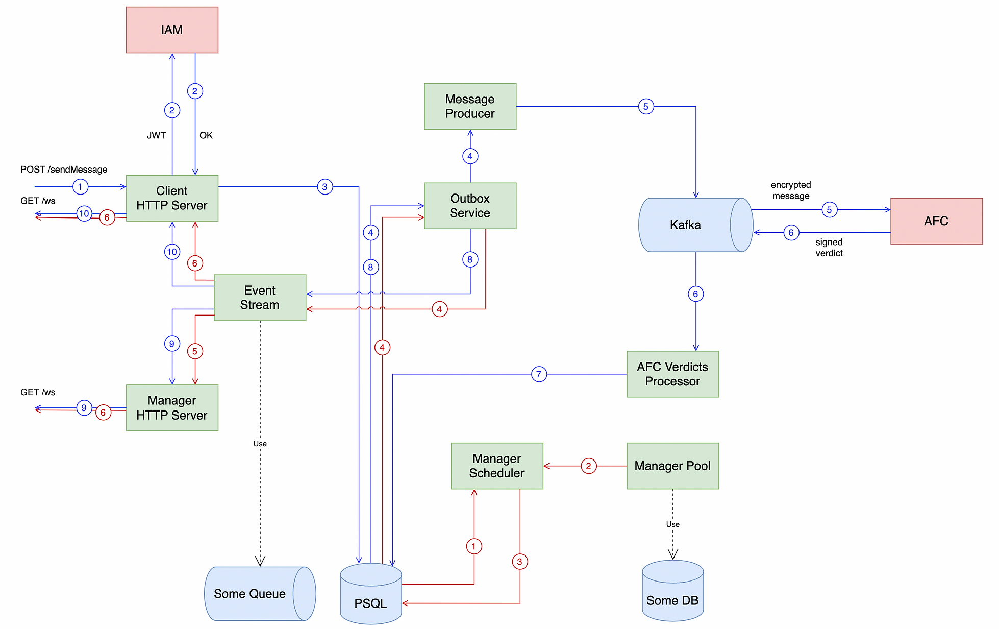

[](https://github.com/lapitskyss/chat-service/actions/workflows/ci.yml)
[](https://goreportcard.com/report/github.com/lapitskyss/chat-service)
[](https://coveralls.io/github/lapitskyss/chat-service)
[![CC BY-NC-SA 4.0][cc-by-nc-sa-shield]][cc-by-nc-sa]

[cc-by-nc-sa]: http://creativecommons.org/licenses/by-nc-sa/4.0/
[cc-by-nc-sa-shield]: https://img.shields.io/badge/License-CC%20BY--NC--SA%204.0-lightgrey.svg

# Bank Support Chat System

Chat for communication between the client and the bank support manager. All messages go through AFC (Anti-Financial Crime) before reaching the manager. The manager can communicate with several clients at the same time.

## Launch
To run commands need to install [Task](https://taskfile.dev/).

```bash
$ git clone git@github.com:lapitskyss/chat-service.git
$ cd chat-service

# Start docker compose with dependencies 
$ task deps

# Start backend service
$ go run cmd/chat-service/main.go

# Start ui-client
# Look at http://localhost:3000/
$ go run cmd/ui-client/main.go

# Start ui-manager
# Look at http://localhost:3001/
$ go run cmd/ui-manager/main.go
```

## Architecture

